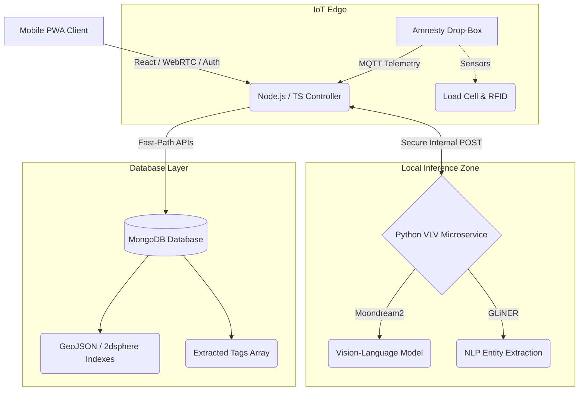

# CampusTrace: AI-Powered Spatiotemporal Property Verification Platform


**CampusTrace** is an enterprise-grade B2B Software-as-a-Service (SaaS) platform designed to modernize and mathematically optimize the management of lost and found assets within high-density educational institutions. 

By combining Edge AI, sophisticated spatiotemporal modeling, and physical IoT integrations, CampusTrace eliminates the administrative friction and legal liabilities (e.g., Section 71 of the Indian Contract Act) of traditional analog asset management. It is meticulously engineered for strict compliance with the **Digital Personal Data Protection (DPDP) Act of 2023**, utilizing 100% on-premises AI inference to prevent data exfiltration.

---

## 📖 Table of Contents
1. [Core Capabilities & Features](#-core-capabilities--features)
2. [System Architecture](#-system-architecture)
3. [Technology Stack](#-technology-stack)
4. [Hardware Integrations](#-hardware-integrations)
5. [Legal & Security Middleware](#-legal--security-middleware)
6. [Getting Started (Developer Guide)](#-getting-started-developer-guide)

---

## 🚀 Core Capabilities & Features

### 1. Zero-Trust 'Secret Key' Verification
Combats adversarial claiming using an automated AI verification pipeline. Finders input a non-obvious "Secret Key" description of the item. Claimants must accurately describe this hidden feature.
- **Auto-Approve (>0.85 Match)**: Instant pickup ticket generated.
- **Auto-Reject (<0.40 Match)**: Denied claim and penalized Trust Score.
- **Provisional (0.40 - 0.85 Match)**: Flagged for manual security review.

### 2. Spatiotemporal Match Probability Modeling
Ditches deterministic, exact-match queries in favor of a probabilistic approach. Synthesizes spatial displacement (via the **Haversine formula**) and temporal decay (exponential decline of pedestrian movement probability) to confidently match lost and found reports despite GPS drift and delays.

### 3. PII Redaction Pipeline
Automatically protects students from DPDP Act violations. An in-memory OCR stream powered by `tesseract.js` scans uploaded images for sensitive government formats (e.g., PAN Cards, Aadhaar Cards). Matching coordinates are aggressively blurred using Gaussian processing *before* the image is ever written to disk.

---

## 🏗 System Architecture

The ecosystem relies on a three-tier architecture ensuring rapid front-end response times, highly selective database queries, and secure, localized AI inference.



---

## 🛠 Technology Stack

| Domain | Technology / Framework | Function |
| :--- | :--- | :--- |
| **Frontend** | React 19, Vite, Tailwind CSS 4 | Mobile-First Progressive Web App. Offline support & dynamic UI. |
| **Backend Core** | Node.js, Express, TypeScript | Business logic, 3-Tier AI routing, and API ingestion. |
| **AI Microservice** | Python, FastAPI, PyTorch | Edge deployment of VLM & NLP models. |
| **Vision Model (VLM)** | Moondream2 (1.8B params) | Small-parameter image reasoning and feature extraction. |
| **NLP Model** | GLiNER | Declarative Named Entity Recognition (NER) for the "Secret Key". |
| **Database** | MongoDB | Spatiotemporal storage using `$geoNear` aggregation pipelines. |
| **Image Processing** | Sharp, Tesseract.js | In-memory PII redaction and Gaussian blurring. |

---

## 📦 Hardware Integrations: Amnesty Drop-Boxes

To provide frictionless 24/7 service, the architecture supports automated steel receptacles equipped with:
- **IoT Modules**: Submitting JSON payloads via MQTT over campus networks.
- **Sensors**: Internal RFID scanners for institutional assets and load cells to verify deposit weights.
- **Redundancy**: Onboard Non-Volatile Memory (NVMe) and Real-Time Clocks (RTC) to buffer payloads during network blackouts, maintaining an immutable chronological chain of custody.

---

## 🛡 Legal & Security Middleware

1. **DPDP Act 2023 Compliance**: Incorporates automated data minimization. 30 days after a successful handover, all PII linking a student to an asset is irreversibly cryptographically shredded.
2. **Indian Contract Act 1872 (Sec 71)**: Drop-box ingestion instantly transfers bailee liability from the student finder to the institution, removing legal friction for good Samaritans.
3. **Dynamic QR Asset Tracking**: For enterprise hardware, rotating cryptographic hashes bypass probabilistic engines, instantly updating the asset registry upon scanning.

---

## 💻 Getting Started (Developer Guide)

### Prerequisites
- **Node.js** (v18+)
- **Python** (3.10+) & `uv` or `pip`
- **MongoDB** instance running locally or via Atlas.
- C++ Build tools (required for `sharp` compilation on some platforms).

### 1. Repository Setup

Clone the repository and install frontend/Node.js dependencies:
```bash
git clone https://github.com/DevOpsDreamer/Campus---Lost-and-Found.git
cd Campus---Lost-and-Found
npm install
```

### 2. Environment Variables

Create a `.env` file in the root directory (use `.env.example` as a template):
```env
# Node.js
PORT=3000
MONGODB_URI=mongodb://127.0.0.1:27017/campustrace
VLV_SERVICE_URL=http://127.0.0.1:8000
JWT_SECRET=your_super_secret_key
```

### 3. Python AI Microservice Setup

Navigate to the python service and initialize the virtual environment:
```bash
cd backend/python-vlv-service
python -m venv venv
# On Windows:
.\venv\Scripts\activate
# On Mac/Linux:
source venv/bin/activate

pip install -r requirements.txt
cd ../..
```

### 4. Run the Full Stack Concurrently

The repository is configured to launch the Vite frontend, the Node.js TypeScript controller, and the Python FastAPI service simultaneously using `concurrently`.

From the root directory, run:
```bash
npm start
```
- **Frontend App**: `http://localhost:3000` (or local IP)
- **Node Backend**: `http://localhost:5000`
- **Python AI API**: `http://127.0.0.1:8000/docs`

> [!NOTE] 
> On the very first run, the Python microservice will download the `moondream2` and `GLiNER` models (~3-4 GB). Please ensure you have sufficient disk space and a stable internet connection.

---

## 📑 References & Architecture Documents
For an in-depth understanding of the mathematical models, database schemas, and enterprise analytics formulation, refer to the included master specification:
- [`CampusTrace PWA System Specification.md`](./CampusTrace%20PWA%20System%20Specification.md)
- [`backend/architecture.md`](./backend/architecture.md)
